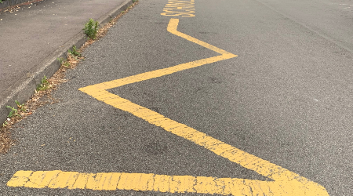
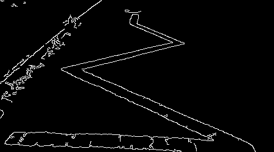
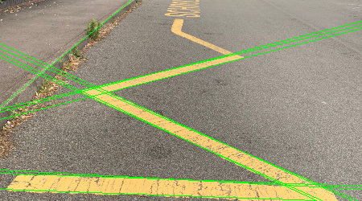
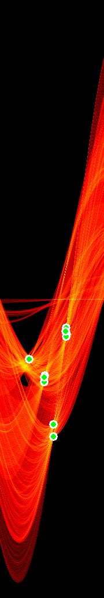
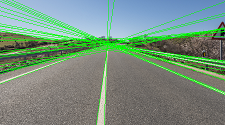

# Hough Transform for Line Detection

โปรเจคนี้ใช้ Hough Transform ในการตรวจจับเส้นตรงในภาพ พร้อมแสดง Hough Space และจุดที่มีเส้นกราฟตัดกันมากที่สุด

## ฟีเจอร์

### 1. การตรวจจับเส้นตรง (Line Detection)
- ใช้ Canny Edge Detection หาขอบภาพ
- ใช้ Hough Transform ตรวจจับเส้นตรง
- วาดเส้นที่ตรวจพบสีเขียวบนภาพ

**Output:**
- `imgs/Edges.png` - ภาพขอบจาก Canny
- `imgs/Hough-Lines.png` - ภาพที่มีเส้นตรวจจับ


*ภาพต้นฉบับ*


*ภาพขอบจาก Canny Edge Detection*


*เส้นที่ตรวจจับได้จาก Hough Transform*

### 2. Hough Space Visualization
- แสดง accumulator array ใน Hough Space
- ใช้ colormap HOT (สีแดง = votes สูง, สีน้ำเงิน = votes ต่ำ)
- ทำเครื่องหมายจุด Top 10 ที่มี votes สูงสุด (จุดสีเขียว)

**Output:**
- `imgs/Hough-Space.png` - Hough Space พร้อมจุด Top 10


*Hough Space แสดงจุดที่มีเส้นกราฟตัดกันมากที่สุด (จุดสีเขียว = Top 10)*

### 3. Top 10 Votes
แสดงค่า ρ, θ และจำนวน votes ของ 10 อันดับแรก

```
10 จุดที่มีเส้นตัดกันมากที่สุดใน Hough Space:
--------------------------------------------------
1. ρ=  49, θ=114°, votes=172
2. ρ= 131, θ= 77°, votes=171
3. ρ=  60, θ=115°, votes=159
4. ρ= 236, θ= 92°, votes=135
5. ρ= 142, θ= 76°, votes=121
...
```

## หลักการทำงาน

### Hough Transform
1. แปลงภาพเป็น grayscale
2. ใช้ Gaussian Blur ลด noise
3. ใช้ Canny Edge Detection หาขอบ
4. แต่ละจุดขอบ → สร้าง sinusoidal curve ใน Hough Space
5. จุดที่เส้นโค้งตัดกันเยอะ = มีเส้นตรงจริงอยู่ในภาพ

### Hough Space
- แกน X = θ (theta) มุม 0-180°
- แกน Y = ρ (rho) ระยะห่างจากจุดกำเนิด
- ค่าใน accumulator = จำนวน votes (จำนวนเส้นโค้งที่ผ่านจุดนั้น)

## ตัวอย่างผลลัพธ์

### ภาพถนน (Road)

*ตรวจจับเส้นขอบถนนและเส้นจราจร*

### ภาพ Zig-Zag Lines

*ตรวจจับเส้นซิกแซก*

## อ้างอิง

- [Hough Transform - GeeksforGeeks](https://www.geeksforgeeks.org/computer-vision/hough-transform-in-computer-vision/)
- [Hough Line Transform - Blog](https://ajgo.blogspot.com/2013/03/hough-line-transform.html)

